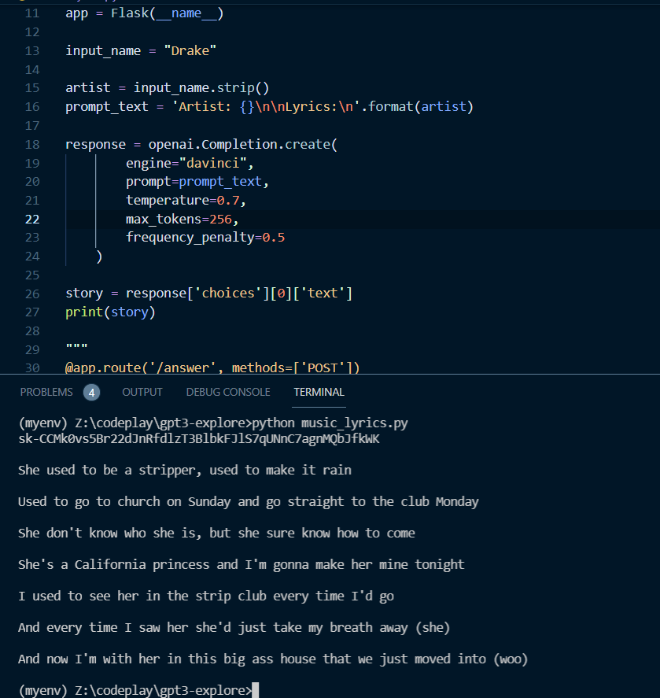
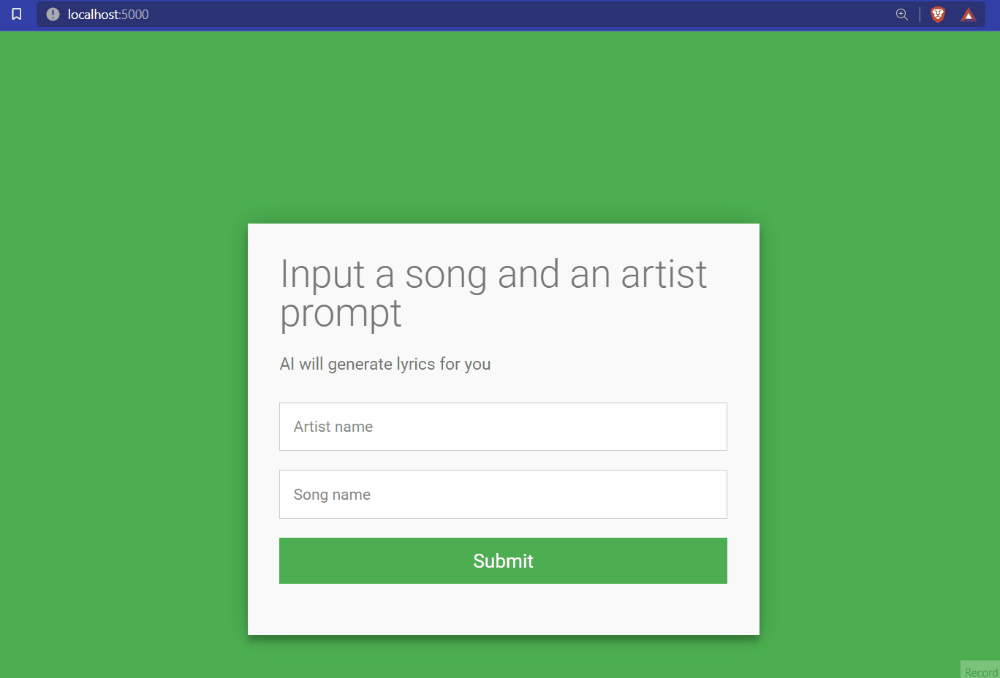

# Trying to explore GPT 3

get your account keys: https://beta.openai.com/account/api-keys

## MUSIC LYRICS

Getting music lyrics is a lot of work. So let openai automate it for you.
Just type in the name of the artist and we'll get you the lyrics.

Next : connecting flask with html
https://stackoverflow.com/questions/11556958/sending-data-from-html-form-to-a-python-script-in-flask

completed flask application

